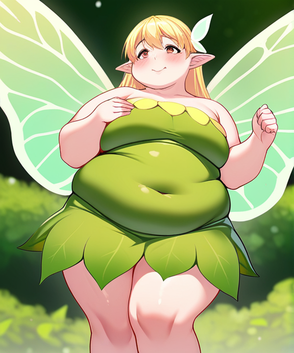

Makes an image retro. Works best on drawings (not so much photos).

How to use (all arguments are optional, example shows their default values):

```
node pixel.js [--img=input.png] [--h=256]
```

<table>
  <tr>
    <th>Input</th>
    <th>Output</th>
  </tr>
  <tr>
    <td></td>
    <td></td>
  </tr>
</table>
